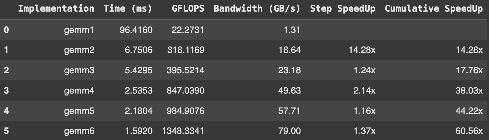
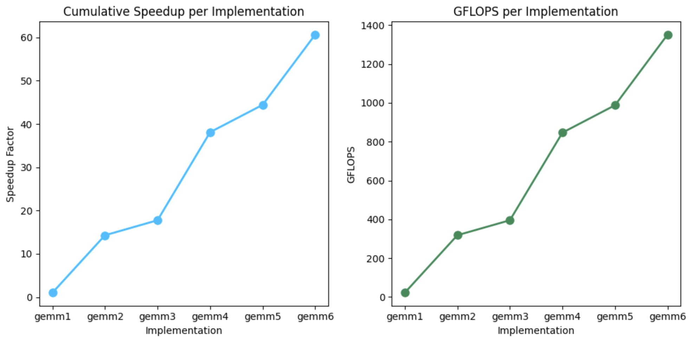
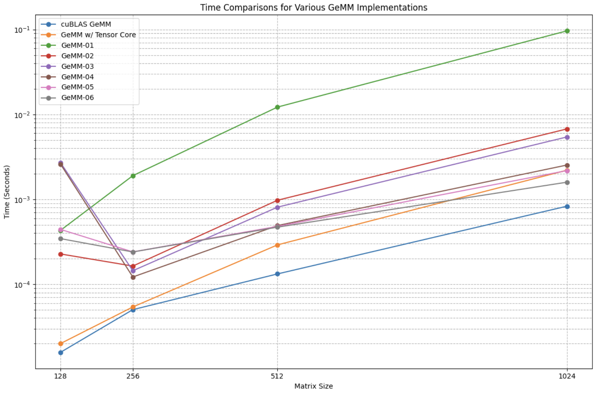
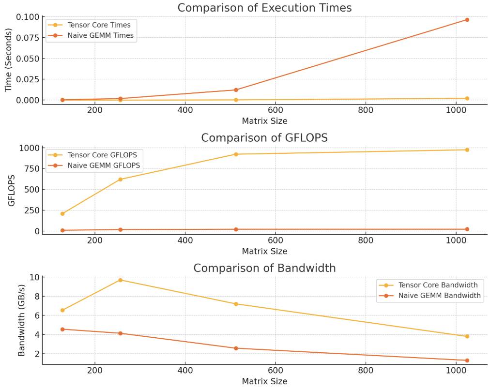

# Optimizing GeMMs

This project focuses on enhancing the performance of single-precision floating-point General Matrix Multiplications (GeMMs). Starting with a naive implementation, optimizations such as coalescing, tiling, coarse, and vectorization have been incrementally applied. These optimizations have been implemented across different thread counts: 128, 256, 512, and 1024. Detailed results for each configuration can be found in the `results/` folder.

## Optimizations Overview
- **GeMM-1**: Naive GeMM
- **GeMM-2**: Coalesced GeMM
- **GeMM-3**: Tiled GeMM
- **GeMM-4**: Coarse 1D GeMM
- **GeMM-5**: Coarse 2D GeMM
- **GeMM-6**: Coarse 2D Vectorized GeMM

## Blog Post
I have also written a more comprehensive documentation of my approach and observations. [You can find the article here!](<https://medium.com/@rimikadhara/6-step-optimization-of-gemms-in-cuda-d3b01d990125>)

## Results
### Comparing results for 1024 Threads (Ranked by Time(s))

### Comparing Time across 128, 256, 512, 1024 threads across ALL Implementations

### Performance Comparison: Naive GEMM vs. Tensor Core GEMM
The visualization of these differences can be seen in the following image, which plots the performance metrics side-by-side for an immediate comparison between the two methods. These two methods are more comparable because the optimization strategies have not yet been implemented on tensor cores. GeMM implemented on Tensor Cores highlights how much of a difference specialized hardware can make on our computations. HOWEVER, it is important to note that the results from Tensor Core GeMM give speed up comparable to GeMM-6!!

The naive GEMM implementation, referred to as GEMM-1, and the tensor core-based implementation shows significant differences in performance across various metrics. The tensor cores utilize specialized hardware acceleration features that allow for more efficient handling of  **MatMul operations specifically**. This leads to markedly shorter execution times, higher GFLOPS, and better bandwidth utilization compared to the naive GEMM-1. These improvements are particularly noticeable as the matrix size increases, underscoring the tensor cores' ability to efficiently scale with larger data sets. 

## Resources
This project was inspired by [this tutorial](https://www.youtube.com/watch?v=GetaI7KhbzM).