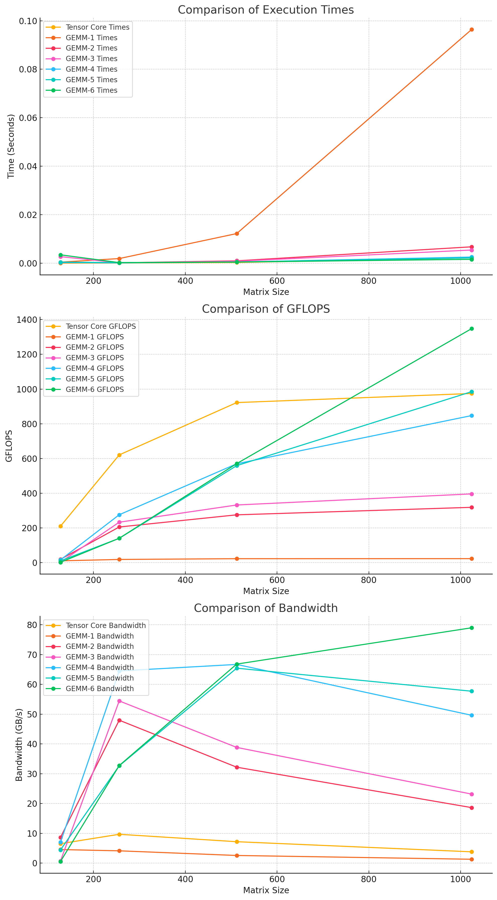

# Optimizing GeMMs

This project focuses on enhancing the performance of single-precision floating-point General Matrix Multiplications (GeMMs). Starting with a naive implementation, optimizations such as coalescing, tiling, coarse, and vectorization have been incrementally applied. These optimizations have been implemented across different thread counts: 128, 256, 512, and 1024. Detailed results for each configuration can be found in the `results/` folder.

## Optimizations Overview
- **GeMM-1**: Naive GeMM
- **GeMM-2**: Coalesced GeMM
- **GeMM-3**: Tiled GeMM
- **GeMM-4**: Coarse 1D GeMM
- **GeMM-5**: Coarse 2D GeMM
- **GeMM-6**: Coarse 2D Vectorized GeMM

## Blog Post
I have also written a more comprehensive documentation of my approach and observations. [You can find the article for free here!](<https://medium.com/@rimikadhara/6-step-optimization-of-gemms-in-cuda-d3b01d990125?sk=e733f9d9c86ea2f78b645d43d14da594>)

## Results
### Comparing results for 1024x1024 Matrix (Ranked by Time(s))

### Comparing Time across 128, 256, 512, 1024 dim square matrices across ALL Implementations

## Quick Notes on Tensor Core Implementation
Tensor Cores are a specialized type of processing unit within NVIDIA GPUs, designed to accelerate the performance of matrix operations, which are a cornerstone of deep learning computations. Introduced with the NVIDIA Volta architecture, Tensor Cores are engineered to perform large matrix operations efficiently by executing mixed-precision arithmetic, combining half-precision (FP16) inputs to produce either half-precision or single-precision (FP32) outputs. Let's look at its key features.
- **Mixed Precision**: By utilizing half-precision inputs and accumulating results in single-precision, Tensor Cores optimize the balance between speed and accuracy. This approach allows more computations to be performed in parallel, reducing the time and power required for data-intensive tasks.
- **High Throughput**: Each Tensor Core can perform 64 floating-point fused-multiply-add (FMA) operations per clock cycle. This enables a significant boost in throughput for operations common in deep learning, such as dot products and matrix multiplications.
- **Difference from CUDA Cores**: One of the biggest differences between CUDA Cores and Tensor Cores is how they can be controlled. CUDA cores can be controlled at a **thread** level and Tensor Cores need to be controlled on a **warp** level.

## Resources
This project was inspired by [this tutorial](https://www.youtube.com/watch?v=GetaI7KhbzM).