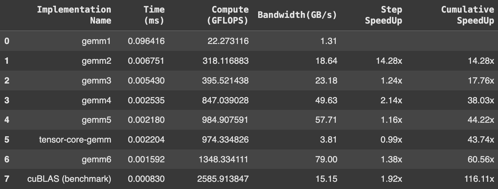

# Optimizing GeMMs

This project focuses on enhancing the performance of single-precision floating-point General Matrix Multiplications (GeMMs). Starting with a naive implementation, optimizations such as coalescing, tiling, coarse, and vectorization have been incrementally applied. These optimizations have been implemented across different thread counts: 128, 256, 512, and 1024. Detailed results for each configuration can be found in the `results/` folder.

## Optimizations Overview
- **GeMM-1**: Naive GeMM
- **GeMM-2**: Coalesced GeMM
- **GeMM-3**: Tiled GeMM
- **GeMM-4**: Coarse 1D GeMM
- **GeMM-5**: Coarse 2D GeMM
- **GeMM-6**: Coarse 2D Vectorized GeMM

## Blog Post
I have also written a more comprehensive documentation of my approach and observations. [You can find the article here](<https://medium.com/@rimikadhara/6-step-optimization-of-gemms-in-cuda-d3b01d990125>)

## Results
### Comparing results for 1024 Threads

## Resources
This project was inspired by [this tutorial](https://www.youtube.com/watch?v=GetaI7KhbzM).